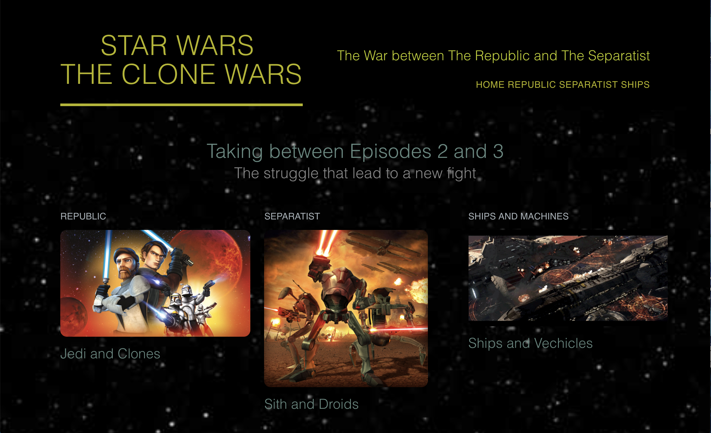
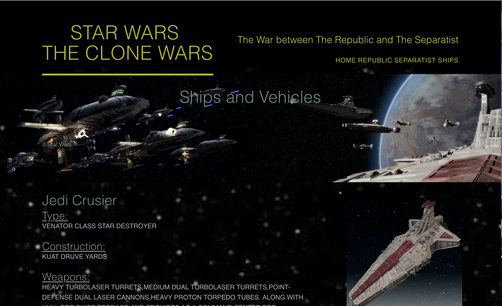

# Star-Wars-FanPage

Basic HTML and CSS fan page based on the animated series: Star Wars The Clone Wars. Four different pages with a home page, a page for ships, and two pages each for the Republic and the Separatist. 

# Images


The main home page of the website with link to the official Star Wars Website.


Ships page with description and images. 

# Technology Used

- HTML
- CSS

# Code Snippets
1)Basic setup of each column with links to site and images of the sections. Each column has it's own width along with a h3 tag and the entire area column is encased in a a href tag. 
```
<section class="grid">

    <section class="teaser col-1-3">
        <a href="republic.html">
        <h5>Republic</h5>

        

        </a>
        <h3>Jedi and Clones</h3>
    </section>

    <section class="teaser col-1-3"> 
        <a href="separatist.html">
        <h5>Separatist</h5>

        
        
        </a>
        <h3>Sith and Droids</h3>
    </section>

    <section class="teaser col-1-3">
        <a href="ships.html">
        <h5>Ships and Machines</h5>

        

        </a>
        <h3>Ships and Vechicles</h3>
    </section>

</section>
```

# Author 
[Muhammad Awais](https://mawais54013.github.io/New-Portfolio/)

[Github](https://github.com/mawais54013)